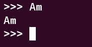
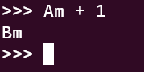
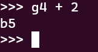
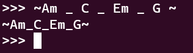
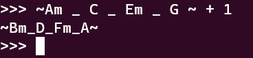
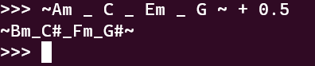
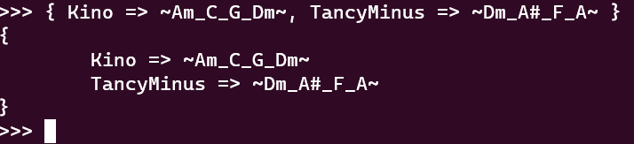

# 2 и 3 задание по курсу формальных языков *"MUS"*
<p>
Контекстно-свободная грамматика и её рабочая версия.<br>
В результате выполнения была составлена грамматика для небольшого интерпретатора работы с последовательностями из нот и аккордов.
</p>

## 2 >>>
*Грамматика называется **mus**, возможно как отсылка к **Muse**, a может сокращение от **Music**.*

При создании этой грамматики хотелось сделать MVP версию инструмента способного собирать Ноты, Аккорды в коллекцию (**Stave - нотный стан**), тональность которой можно повышать на тон или полутон соответсвенно.

Также в грамматике есть коллекция, похожая на *\% HASH* из языка Perl.
А также просто коллекция списка просто для объёма.<br>
Давайте рассмотрим какие правила определены в рамках данной грамматики.

1. expr - выражение может быть : бинарной операцией сложения вычитания - необходима для регулирования тональности, раскрытие скобок, а также используемые типы, которые будут описаны далее.
```
expr: left=expr op=('+'|'-') right=expr        # InfixExpr
    | '(' expr ')'                             # ParenExpr 
    | atom=INT                                 # NumberExpr
    | atom=REAL                                # RealExpr
    | atom=NOTA                                # NotaExpr
    | atom=CHORD                               # ChordExpr
    | atom=STAVE                               # StaveExpr
    | atom=SONGS                               # SongsExpr
    | atom=LIST                                # ListExpr
    | atom=HELLO                               # HelloExpr
    | atom=BYE                                 # ByeExpr
    ; 
```
2. fragment WORD : [A-Za-z][A-Za-z0-9]* - служебная подстановка для ключей словаря
3. INT  : [0-9]+ - целочисленный тип для тона
4. REAL : INT'.'INT - вещественный тип для полутона
5. NOTA : [a-g][0-9] 
     | [a-g]'#'[0-9] - нотация ноты
6. CHORD: [A-G]
     | [A-G]'m'
     | [A-G]'#' 
     | [A-G]'#''m' - нотация аккорда
7. WS   : [ \t]+ -> skip  - пробельное правило для красивой записи коллекций
8. FIRST_STAVE_ELEMENT : NOTA | CHORD - первый элемент в коллекции нотного стана
9. fragment STAVE_ELEMENT : (WS* '_' WS* FIRST_STAVE_ELEMENT )* - последующий элемент в коллекции
10. STAVE : '~' WS* FIRST_STAVE_ELEMENT STAVE_ELEMENT WS* '~' - коллекция нотного стана

11. FIRST_SONG : WORD WS* '=>' WS* STAVE - первый элемент словаря песен(нотных станов)
12. fragment SONG : (WS* ',' WS* FIRST_SONG )* - последующий элемент
13. SONGS : '{' WS* FIRST_SONG SONG WS* '}'- коллекция из именованных нотных станов

14. FIRST_LIST_ELEMENT : INT | REAL | NOTA | CHORD | STAVE | SONGS - первый элемент списка
15. fragment LIST_ELEMENT : (WS* ',' WS* FIRST_LIST_ELEMENT )* - последующий
16. LIST : '[' WS* FIRST_LIST_ELEMENT LIST_ELEMENT WS* ']' - коллекция списка
17. HELLO: ('hello'|'hi'|'hallo'|'privet'|'whoami'|'SAYMYNAME!') - оператор приветствия
18. BYE  : ('bye'|'tata'|'yougoddamnright') - оператор завершения работы интерпретатора

## 3 >>>
### Установка
Тестировалось на Ubuntu LTS 20.04
<br>
**ANTLR4**<br>
Если нету JDK
```
sudo apt-get install default-jdk
```
```
cd /usr/local/lib
sudo curl -O https://www.antlr.org/download/antlr-4.9.2-complete.jar
export CLASSPATH=".:/usr/local/lib/antlr-4.9.2-complete.jar:$CLASSPATH"
```
Runtime для Python
```
python3 -m venv venv
source venv/bin/activate 
pip install -r requirements.txt
```
Остальное подготовлено в Makefile
```
make
```

### Демонстрация работы









